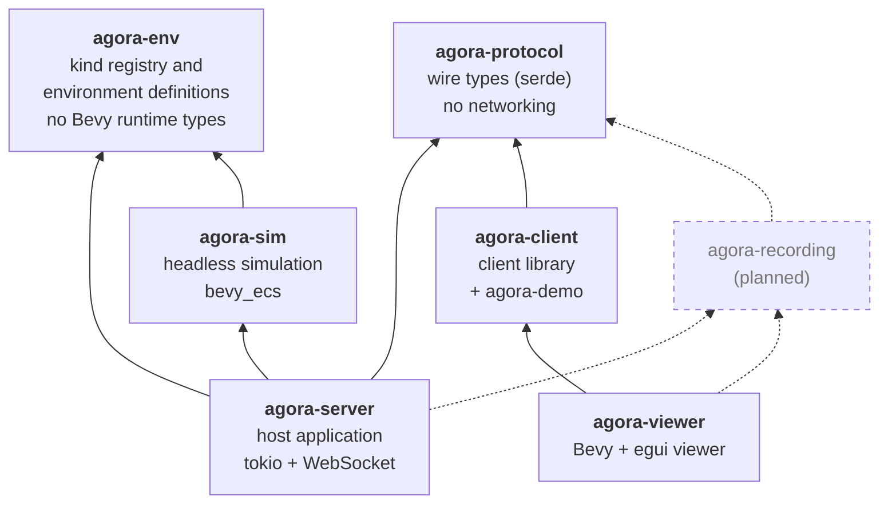
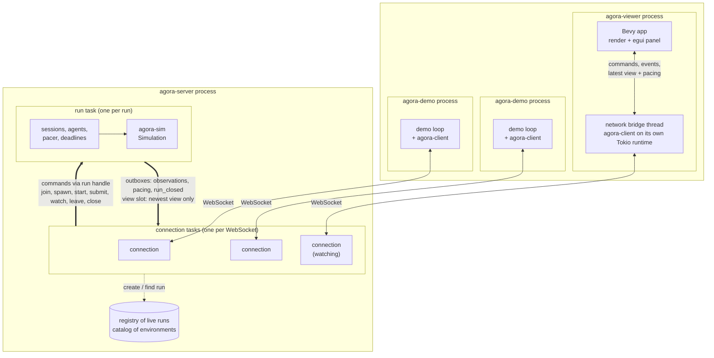
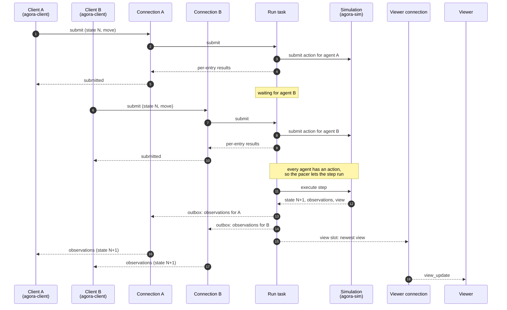

# How the Rust components fit together

A visual guide to the Rust workspace. It summarizes the [SADD](sadd.md) and the component design descriptions ([CDD-001](../components/simulation/cdd.md) to [CDD-004](../components/viewer/cdd.md)), which remain the canonical descriptions; if a diagram here disagrees with them, they win and this page needs updating. The diagrams use [Mermaid](https://mermaid.js.org/), which GitHub renders in place.

## Package dependencies

Which crates depend on which at build time. Solid boxes exist today; dashed boxes are planned.

Points worth noticing:

- **`agora-sim` does not depend on `agora-protocol`.** The simulation keeps its own types and the server maps them to protocol messages, so wire concerns stay out of simulation code ([package mapping](sadd.md#rust-package-mapping)).
- **`agora-env` is data only.** It declares every kind and how it looks, and loads environment definitions, with no Bevy runtime types, so tools can use it without the simulation. The server builds its catalog from the bundled definitions and sends the registry and terrain to viewers in wire form rather than the viewer depending on it.
- **The viewer does not depend on `agora-sim`.** It draws from the view data the server sends, not from simulation types ([ADR-002](../decisions/0002-inspection-and-debug-visualization.md)). It reaches the server through the same client library any Rust client uses, and gets `agora-protocol` through it.
- **The server and client share only `agora-protocol`.** Any client in any language that follows the [client protocol](../contracts/client-protocol.md) can take part; the planned Python trainer is one.
- `agora-client` and `agora-viewer` use `agora-server` only as a dev-dependency, to run tests against a real server.

## Runtime structure

What runs where once a server, a viewer, and two demo clients are connected to one run. Every client, the viewer included, talks to the server over its own WebSocket connection using the client protocol.

- **Connection task** ([CDD-002](../components/server/cdd.md#internal-structure)): one per WebSocket. It performs the handshake, answers each request before reading the next, and forwards anything the run pushes. It holds at most one session at a time.
- **Run task:** one per run, owning that run's `Simulation`. Connection tasks send it commands through a channel, so every call into the simulation is serialized, and separate runs never share an action barrier.
- **Outbox and view slot:** the run pushes observations, pacing updates, and closure notices to each session's outbox, which keeps every message. Views go to a viewer's view slot, which keeps only the newest, so a slow viewer skips stale frames rather than falling behind.
- **Client library** ([CDD-003](../components/client/cdd.md#internal-structure)): a background task owns the socket. Observations arrive on a stream that drops nothing, because agent code must see every state. Views and pacing state are latest-value handles, matching the server's newest-only delivery.
- **Viewer** ([CDD-004](../components/viewer/cdd.md#internal-structure)): the network bridge runs the client library on its own thread, so Bevy never waits on the network. Bevy reads the latest view and pacing state once per frame and sends button presses to the bridge as commands.

## One step, end to end

How a step flows once a run has started with two agents and a viewer is watching. Pacing is unlimited here; with an interval or a pause, the run task waits for the pacer before executing.

Because a connection answers a request before it forwards pushes, the `submitted` response that completes a step always arrives before that step's observations ([SPEC-002-R11](../contracts/client-protocol.md)).

## Where to read more

| Area | Design | Specs |
| --- | --- | --- |
| System structure and package boundaries | [SADD](sadd.md), [ADR-001](../decisions/0001-rust-package-boundaries.md) | — |
| Simulation (`agora-sim`) | [CDD-001](../components/simulation/cdd.md) | [SPEC-001](../components/simulation/specs/lifecycle-and-movement.md) |
| Server (`agora-server`) | [CDD-002](../components/server/cdd.md) | [SPEC-003](../components/server/specs/sessions-and-runs.md) |
| Client library (`agora-client`) | [CDD-003](../components/client/cdd.md) | [SPEC-004](../components/client/specs/client-library.md) |
| Viewer (`agora-viewer`) | [CDD-004](../components/viewer/cdd.md) | [SPEC-005](../components/viewer/specs/viewer.md) |
| Wire protocol (`agora-protocol`) | [Shared contracts](../contracts/README.md) | [SPEC-002](../contracts/client-protocol.md) |
